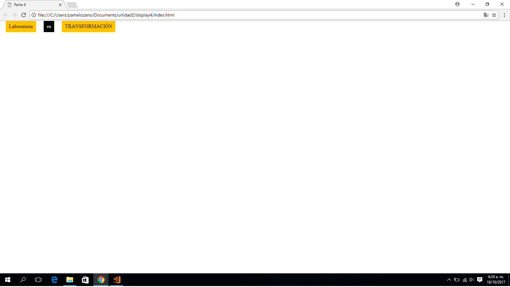

## PARTE 4

### DISPLAY BLOQUE
Este repositorio contiene un proyecto de banderas trabajado con __**(display inline)**__.

### Pondremos en práctica lo siguiente:
1. Aplicaremos **selectores:**
    * Selector universal: *
    * Selector de elemento: **div**
    * Selector de clases: atributo **class**

2. Aplicaremos __"elementos que componen el modelo de caja"__
    * Padding **(relleno)**.
    * Margin **(margen)**

3. Aplicaremos la __"propiedad de los elementos de caja""__
    * display **(por bloques)**
    * background-color **(Color al bloque)**
    * color **(para el contenido)**
    * box-sizing: **border-box**
    * font-family: **'Times New Roman'**

### Herramientas Utilizadas:
1. HTML
2. CSS3

### Imagen final:

